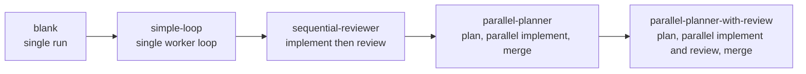
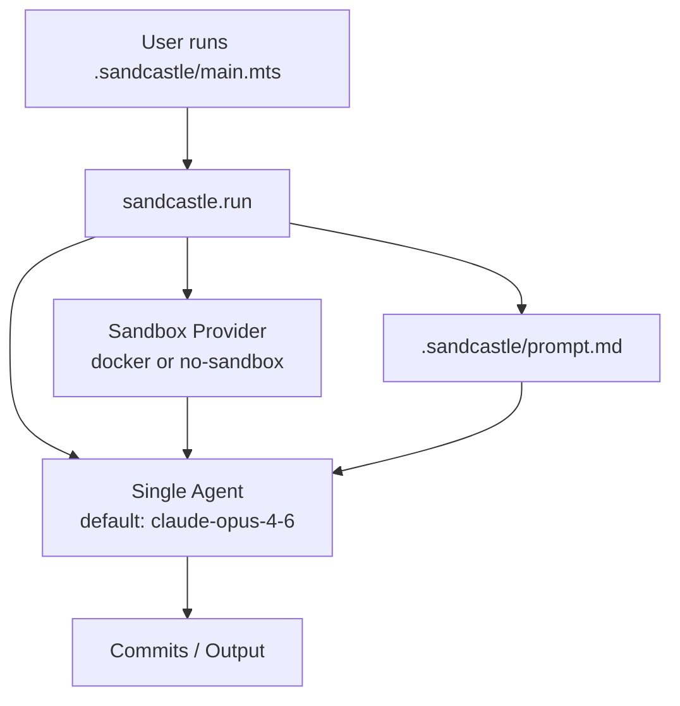
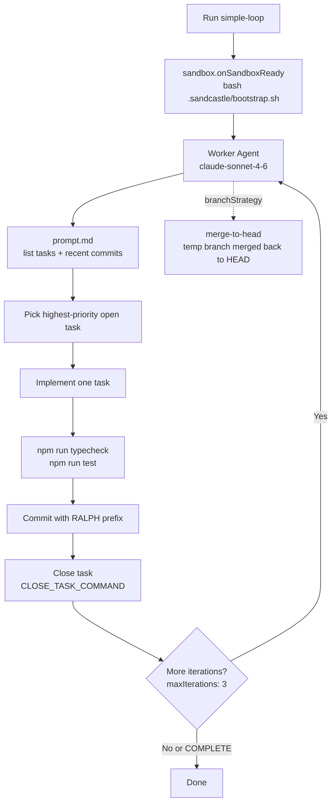
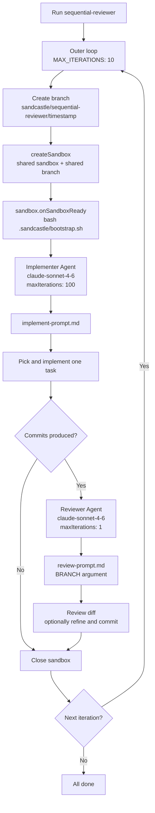
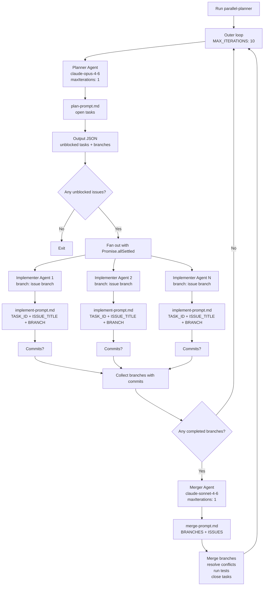
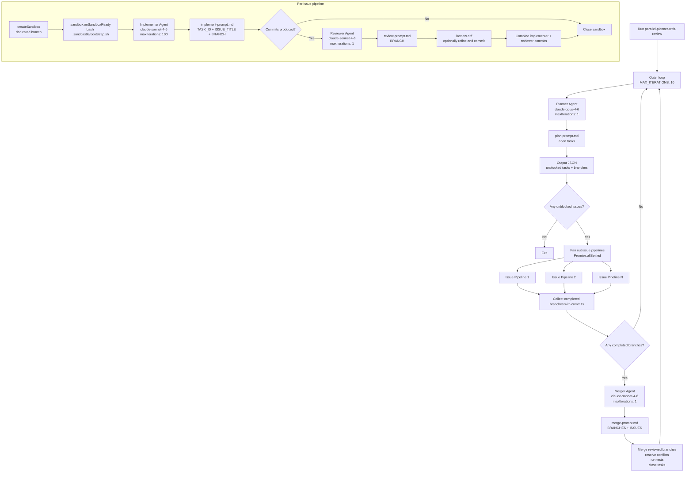

# Sandcastle Templates Agent 编排模式

本文整理 Sandcastle 现有 workflow templates 对应的 agent 编排框架图。这里的 template 指 `sandcastle init` 复制到 `.sandcastle/` 的工作流模板；它定义 agent 如何协作，不定义项目语言或构建系统。项目语言和 bootstrap 假设由 Project profile 负责。

## 总览

## blank

`blank` 是最小脚手架：一个 prompt、一个 agent、一次 `sandcastle.run()`。它适合从空白处自定义 orchestration。

## simple-loop

`simple-loop` 使用单个 worker agent 顺序处理任务。每轮选一个 open task，完成实现、验证、提交并关闭任务。

## sequential-reviewer

`sequential-reviewer` 每轮创建一个共享 sandbox 和显式分支。implementer 先实现任务，若产生 commit，reviewer 在同一分支上审查并可直接修正。

## parallel-planner

`parallel-planner` 将 backlog 处理拆成规划、并行执行、合并三个阶段。planner 输出 `<plan>` JSON，多个 implementer 分支并行工作，merger 负责合并成功产生 commit 的分支。

## parallel-planner-with-review

`parallel-planner-with-review` 是当前最完整的模板。它保留 planner 和 merger，同时把每个 issue 的执行管线升级为 implementer + reviewer。所有 issue pipeline 并行运行，每条 pipeline 内部顺序实现、审查、合并 commit 结果。

## 选择建议

| 目标                                       | 推荐模板                       |
| ------------------------------------------ | ------------------------------ |
| 从最小示例开始，自定义自己的编排           | `blank`                        |
| 单 agent 逐个处理任务                      | `simple-loop`                  |
| 逐个处理任务，但每次实现后都要 review      | `sequential-reviewer`          |
| 并行处理多个互不阻塞任务                   | `parallel-planner`             |
| 并行处理任务，并对每个分支增加 review gate | `parallel-planner-with-review` |
