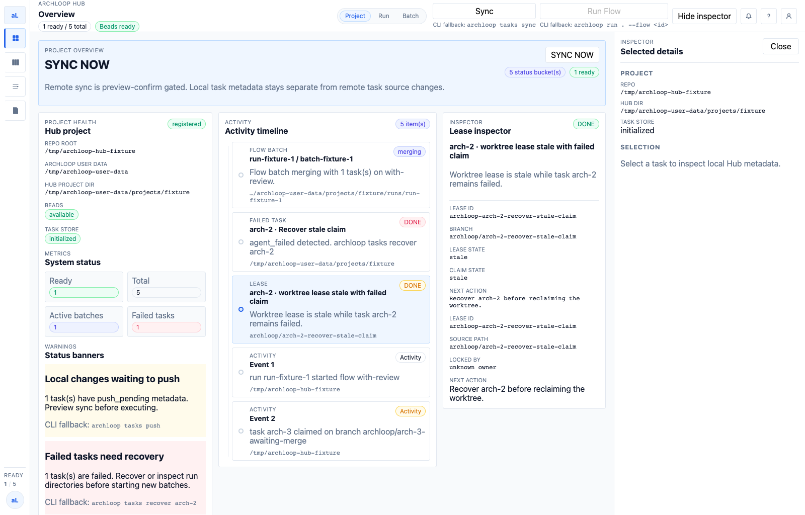
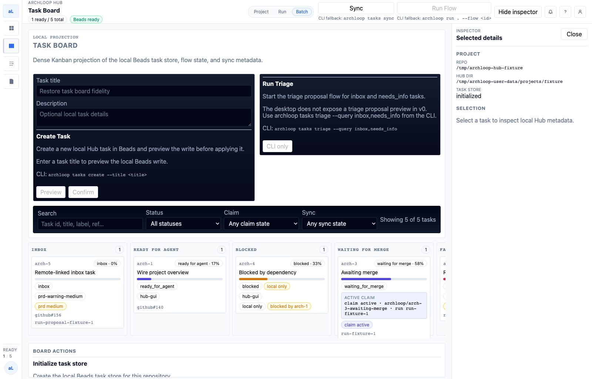
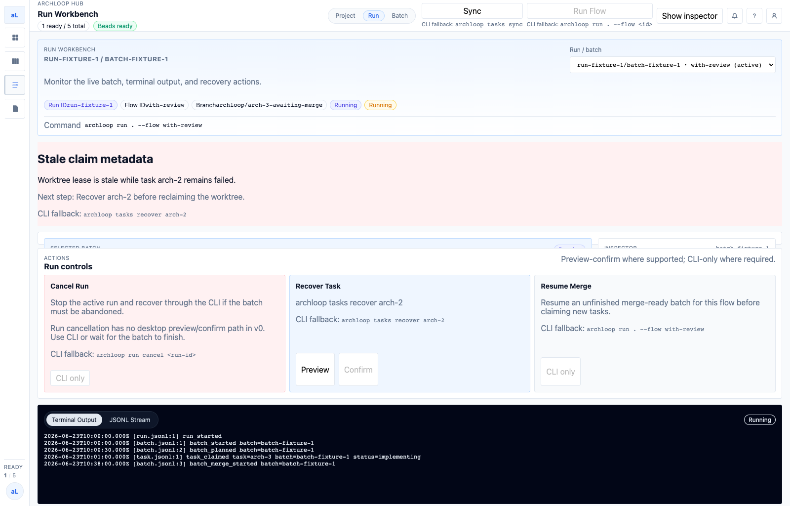
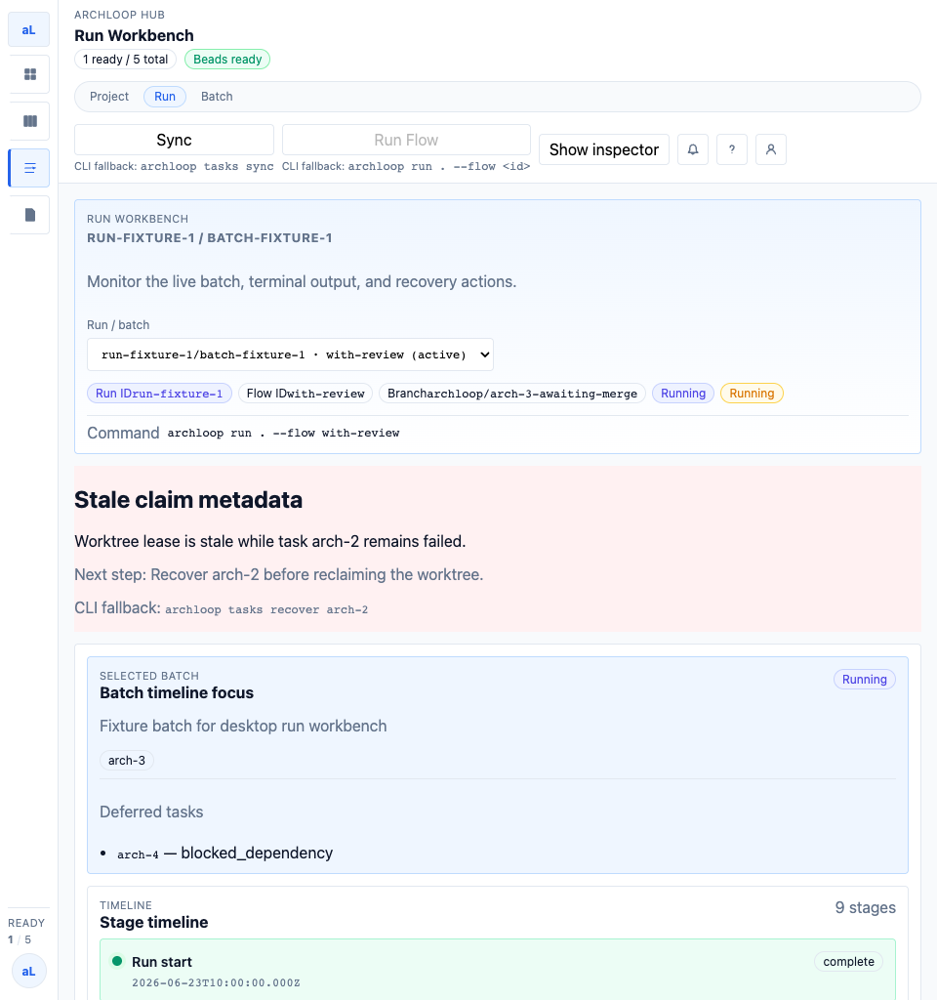
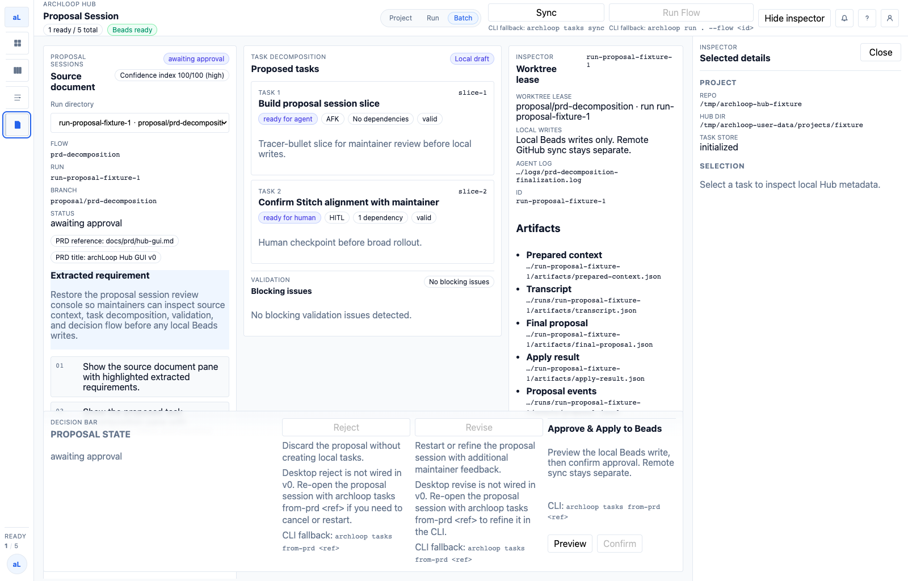

# archLoop GUI 当前状态与问题汇总

更新时间：2026-06-24 17:50 CST  
来源：`docs/qa/runs/hub-gui-v0-2026-06-24-rerun-5.md`  
GitHub issue：[#171 Hub GUI restoration QA fails Stitch visual contract](https://github.com/Yibeibankaishui/archLoop/issues/171)

## 结论

当前 GUI **未通过 Stitch 视觉恢复 QA**。

这轮修复已经解决两个主要桌面首屏问题：

- Run Workbench 在 1600px 首屏已能同时展示 run controls 和深色 terminal 输出。
- Proposal Session 在 1600px 首屏已能看到底部 decision bar，不再隐藏到折叠以下。

剩余阻塞点集中在 **Task Board 的视觉合同还原**：当前首屏仍被 Create Task / Run Triage 大面板占据较多空间，Kanban 看板不是第一视觉主体，且右侧列默认有裁切感。

## 当前 GUI 截图

> 飞书同步后，本地截图会作为图片插入到文档末尾；本节同时保留本地相对路径，便于回到仓库定位原始证据。

### Overview

说明：Overview 当前结构稳定，顶部 Sync preview 交互可用；Header fallback 文本仍略紧，但不再作为阻塞项。

### Task Board

说明：Task Board 仍是主要问题。Create Task 和 Run Triage 使用大面板，占据首屏上半区；Kanban 看板被推到下方，右侧列默认被裁切。

### Task Board 选中任务

说明：选择 `arch-2` 后 inspector 能正确更新到 `Recover stale claim`，功能交互是通过的。

### Run Workbench

说明：1600px 桌面首屏已经能看到 run controls 和 terminal 输出，上一轮 P1 问题基本修复。

### Run Workbench 960px

说明：960px 下 terminal/action area 仍在首屏以下，这是响应式密度风险，但严重程度低于桌面首屏问题。

### Proposal Session

说明：Proposal Session 首屏已显示 decision bar，Approve / Reject 区域不再隐藏到折叠以下。

## 自动化门禁结果

| 检查项                                        | 结果    | 备注                                            |
| --------------------------------------------- | ------- | ----------------------------------------------- |
| `npm run typecheck`                           | Pass    | root typecheck 通过                             |
| `npm run build`                               | Pass    | root build 和 postbuild 通过                    |
| `hub-desktop/npm run typecheck`               | Pass    | renderer 和 Electron TS 检查通过                |
| `hub-desktop/npm run build`                   | Pass    | Vite renderer build 和 Electron build 通过      |
| `hub-desktop/npm run build:renderer-fixtures` | Pass    | fixture renderer build 通过                     |
| Targeted Hub GUI Vitest                       | Pass    | 8 files / 76 tests passed                       |
| Renderer fixture browser smoke                | Pass    | 四个主屏均可由 Playwright 访问                  |
| Real Electron smoke                           | Blocked | 当前 Codex host 仍受 LaunchServices/AppKit 限制 |

## 当前存在问题

### P2：Task Board 首屏没有以 Kanban 为第一主体

现象：

- Create Task 和 Run Triage 仍是大型深色面板。
- Kanban 列从首屏中部以后才开始出现。
- 1600px 默认视口下右侧列有裁切感。

影响：

- 与 Stitch Task Board 参考稿不一致。
- 参考稿中 Create Task / Run Triage 是紧凑 toolbar action，Kanban 是首屏主体。
- 当前布局降低任务扫描效率，不符合「高密度本地任务控制面」定位。

建议：

- 将 Create Task / Run Triage 收敛为 toolbar 按钮或 compact drawer。
- 让 Kanban board 从首屏顶部主体区域开始。
- 保持列宽稳定，并提供明确、可见的水平 overflow 行为。

### P3：Run Workbench 960px 下 terminal 仍在首屏以下

现象：

- 1600px 已修复。
- 960px 顶部视口仍主要展示 header、stale claim metadata 和 timeline，terminal/action area 位于折叠以下。

影响：

- 不阻塞桌面主视口恢复，但仍是窄屏响应式密度风险。

建议：

- 在 960px 下压缩 metadata/banner 高度。
- 让 terminal/action area 至少露出顶部，提示用户下方存在执行输出。

## 已验证可用交互

- Overview：`SYNC NOW` 打开 `Sync preview`，`Confirm` 可点击。
- Task Board：选择 `arch-2` 后 inspector 更新到 `Recover stale claim`。
- Run Workbench：`Terminal Output` / `JSONL Stream` tab 可切换。
- Proposal Session：`Approve & Apply to Beads` 点击 Preview 后 Confirm 可用。

## 当前发布判断

不建议关闭 #171。

Run Workbench 和 Proposal Session 的桌面首屏问题已经明显改善，但 Task Board 仍需要一次 Kanban-first 布局修复，才能认为 GUI 对 Stitch 合同恢复达标。
