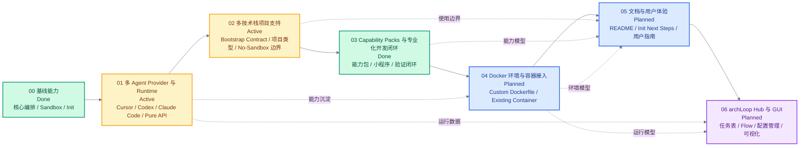

# Roadmap

本 roadmap 以代码与 git 提交为准，用于把 archLoop 的阶段性方向、当前进度和后续 PRD 对齐。飞书云文档采用固定映射双向协作；当本地与云端内容冲突时，先人工审阅，再用同步流程覆盖目标文档。

## 00 基线能力

Status: Done

Version: `ecd26a877af1f33827e95b7c5d49bdabdd48a4b7`

Goal: 记录该提交及之前已经稳定存在的 archLoop 核心编排、sandbox、agent provider、init 和模板能力。

### Scope

- 程序化 `run()` API、multi-iteration execution、completion signal、commit collection、log-to-file mode、terminal mode 和 agent stream event callback。
- 可插拔 sandbox provider 抽象，包括 bind-mount、isolated、no-sandbox，以及 Docker、Podman、Vercel、Daytona 和 no-sandbox provider。
- Branch strategy 与 worktree model，包括 `head`、`merge-to-head`、显式 `branch`、`.archloop/worktrees/`、`createWorktree()` 和 `createSandbox()`。
- Prompt 与 output model，包括 inline prompt、prompt template、argument substitution、sandbox shell expression expansion、`Output.object()` 和 `Output.string()`。
- Claude Code、Codex、Pi、OpenCode agent provider，以及 provider-specific command construction、stream parsing、Claude Code session capture、resume 和 usage parsing。
- Host lifecycle hooks、sandbox lifecycle hooks、`.archloop/.env`、provider env merge、`copyToWorktree`、timeout 配置和 `AbortSignal` 取消流程。
- `archloop init` 的 `.archloop/` scaffold、模板选择、Dockerfile / Containerfile 生成、GitHub Issues / Beads backlog manager、GitHub `archLoop` label、内置 workflow 模板，以及 Docker / Podman image 命令。

### Deliverables

- README 覆盖 baseline public API 和 CLI 基础用法。
- ADR 与 `CONTEXT.md` 记录 baseline 架构决策、术语和领域语言。
- 后续阶段不再把本节能力作为未来待实现事项，只描述增强、重构或体验改进。

### Out of Scope

- Fork 之后新增的 Cursor provider、多 runtime init、preset agent roles、bootstrap contract、GUI 和后续文档体验优化。

## 01 多 Agent Provider 与 Runtime

Status: Active

Goal: 让 archLoop 可以在同一项目中组合 Cursor、Codex、Claude Code 等 agent provider 与 installed runtimes。

### Scope

- Cursor agent provider 与多 provider 组合工作流。
- `archloop init` 中 default scaffold agent 与 installed runtimes 的分离。
- 多 runtime Dockerfile / Containerfile 组合。
- Codex、Cursor、GitHub Issues 等运行时认证 setup flow。
- Preset agent roles 与 provider/runtime 能力矩阵。
- Pure API 模式的目标形态、边界和集成方式探索。

### Deliverables

- `archloop init` 能生成以一个默认 scaffold agent 为入口、同时安装多个可用 runtime 的项目配置。
- Runtime image composition 与 auth setup flow 能支持 Cursor、Codex、Claude Code 等组合使用。
- Provider/runtime 的认证、session、stream、resume 和限制在文档中可被清晰比较。
- Pure API 模式有明确 PRD 或设计文档承接，不与 CLI init 行为混杂。

### Tasks

- [x] 增加 Cursor agent provider。
- [x] 区分 default scaffold agent 与 installed runtimes。
- [x] 支持多 runtime Dockerfile / Containerfile composition。
- [x] 增加 Codex、Cursor、GitHub Issues 相关 auth setup flow。
- [x] 完成 preset agent roles 初版。
- [ ] 明确 pure API 模式的目标形态与边界。
- [ ] 梳理 provider/runtime capability matrix。
- [ ] 补齐多 agent provider 组合示例和用户文档。

相关文档：[multi-agent-runtimes-init](./prd/multi-agent-runtimes-init.md)、[preset-agent-roles](./prd/preset-agent-roles.md)。

## 02 多技术栈项目支持

Status: Active

Goal: 让 archLoop 不再默认假设 Node 项目，而是通过项目级 bootstrap contract 支持不同语言、框架和构建系统。

### Scope

- `.archloop/bootstrap.sh` 作为 repository-specific bootstrap contract。
- `archloop init` 按 Project profile 生成 bootstrap script，模板在 sandbox 就绪时执行。
- `archloop init` 的 sandbox 入口收敛为 `docker` 与 `no-sandbox`，并把 `podman` 保留为非 init 路径下的可用能力。
- `archloop init` 生成的入口文件需要和 sandbox 选择保持一致，并在 no-sandbox 组合下校验必要的 host 依赖。
- 模板不再默认假设 `node_modules`、`npm install` 或 Node-only workflow。
- `archloop init` 根据项目类型生成更贴近目标项目的 Dockerfile / Containerfile 基础配置。
- 常见项目类型的 sandbox 环境建议，包括 Node、Python、C++ 等技术栈。
- Unsandboxed / no-sandbox 模式的安全边界、适用场景和用户提示。

### Deliverables

- 非 blank 模板依赖项目内 bootstrap contract，而不是内嵌某一技术栈的安装命令。
- 常见技术栈有可复用 bootstrap 示例，用户可以快速迁移到自己的项目。
- `archloop init` 能让用户选择项目类型，并生成包含相应语言运行时、包管理器和验证工具的 sandbox 环境骨架。
- `archloop init` 的交互和 scripted 参数与当前策略一致：支持 `docker` 与 `no-sandbox`，不再把 `podman` 作为 init 选项暴露。
- `archloop init` 选择 `no-sandbox` 时，生成的 `main.mts` / `main.ts` 会显式使用 `noSandbox()`，并对 `beads` 等 host 依赖给出校验与提示。
- Docker image、mount、auth 和 no-sandbox 行为在跨技术栈项目中有一致说明。

### Tasks

- [x] 非 blank 模板引入 `.archloop/bootstrap.sh`。
- [x] 完成 Project profile / bootstrap contract 设计收敛，并同步到 `CONTEXT.md`、ADR 和 roadmap（见 [project-profiles-init-bootstrap](./prd/project-profiles-init-bootstrap.md)、[ADR-0015](./adr/0015-project-profiles-generate-bootstrap-at-init-time.md)）。
- [x] 模板移除对 `node_modules` 或 `npm install` 的默认假设。
- [x] 完成 `archloop init` 项目类型选择的产品/交互设计，包括 scripted init 参数和交互式选择（见 [#20](https://github.com/yibeibankaishui/archloop/issues/20)）。
- [x] 完成 Node、Python、C++ Project profiles 的实现拆分与 issue 准备（见 [#23](https://github.com/yibeibankaishui/archloop/issues/23)、[#24](https://github.com/yibeibankaishui/archloop/issues/24)、[#25](https://github.com/yibeibankaishui/archloop/issues/25)）。
- [x] 明确通用 Docker 镜像与 Project profile 的边界，并确认 bootstrap 不参与 image build、不由 init 验证（见 [ADR-0015](./adr/0015-project-profiles-generate-bootstrap-at-init-time.md)）。
- [x] Project profile 影响生成 prompt 中的默认验证命令提示（见 [#75](https://github.com/yibeibankaishui/archloop/issues/75)）。
- [x] 调整 `archloop init` 的 sandbox 选项：新增 `no-sandbox`，隐藏 `podman`（保留 podman 命令与运行时代码）。
- [x] 修复 `archloop init` 的 scaffold 入口与 sandbox 选择脱节的问题，并为 `no-sandbox + beads` 增加 `bd` host 依赖校验与提示。
- [ ] 实现 `generic` Project profile 与 `--project-profile` 基础路径（见 [#21](https://github.com/yibeibankaishui/archloop/issues/21)）。
- [ ] 实现模板侧 runtime bootstrap generation 移除（见 [#22](https://github.com/yibeibankaishui/archloop/issues/22)）。
- [ ] 实现 Node、Python、C++ Project profiles（见 [#23](https://github.com/yibeibankaishui/archloop/issues/23)、[#24](https://github.com/yibeibankaishui/archloop/issues/24)、[#25](https://github.com/yibeibankaishui/archloop/issues/25)）。
- [ ] 为常见技术栈沉淀 bootstrap 示例。
- [x] 梳理并落地 `noSandbox()` 在 `run()` / `createSandbox()` 中的使用边界与适用场景。
- [ ] 修复 init 生成的 auth mount 目录缺失导致 sandbox 启动前失败的问题（见 [#19](https://github.com/yibeibankaishui/archloop/issues/19)）。

相关文档：[project-profiles-init-bootstrap](./prd/project-profiles-init-bootstrap.md)、[ADR-0015](./adr/0015-project-profiles-generate-bootstrap-at-init-time.md)、[bootstrap-template-contract](../.changeset/bootstrap-template-contract.md)。

## 03 Capability Packs 与专业化开发闭环

Status: Done

Version: `f9e432fd88279e25169555bbb3d7d1e846304e0c`

Target: [capability-packs](./prd/capability-packs.md)

Goal: 让 `archloop init` 可以显式选择专业化能力包，生成包含工具上下文、agent 规则和验证入口的开发闭环。

### Scope

- Capability pack 作为显式 init-time 选择，组合 template、Project profile、preset agents、skills、context files、verification entrypoint 和 capability add-ons。
- Capability pack 默认值与显式 init flags 的优先级规则。
- 小程序能力包默认使用 `parallel-planner-with-review`，并支持 `parallel-planner`、`parallel-planner-with-review`、`sequential-reviewer`、`simple-loop` 等模板。
- Init-time prompt assembly，把 preset role、skill、capability context、verification guidance 和选中的 add-on guidance 生成到可编辑 prompt template。
- `.archloop/capability.json` capability manifest。
- `.archloop/verify.sh` verification entrypoint。
- `generic` 与 `miniprogram` 两个第一版 capability packs，其中小程序第一版只支持 native capability variant。
- WeChat Mini Program core loop：`.archloop/verify.sh`、`npm run wx:check`、`miniprogram-ci preview`（检测到配置时自动调用）、`debug/wx-check.log`。
- `.archloop/wx-check-native.mjs` native fallback verifier，用于没有项目级 `wx:check` 时的原生小程序结构检查。
- 小程序 init-time project setup：检测 `miniprogram-ci`，缺失时让用户选择是否安装到项目中。
- no-sandbox-only Mini Program capability add-on：`runtime-debug`（WeChat DevTools MCP）。

### Deliverables

- `archloop init --capability miniprogram` 可以生成专业化的小程序 agent 环境。
- 小程序第一版能力包可以在原生微信小程序项目中提供默认 verifier；Taro、uni-app 等跨端框架会被明确标记为 unsupported variant。
- 小程序默认 verifier 在未配置 `miniprogram-ci` 时继续本地闭环；检测到上传密钥等平台验证配置时必须调用 `miniprogram-ci preview`，配置错误则失败并写入诊断。
- 小程序 init 会检测 `miniprogram-ci` 并在缺失时提供显式项目安装选择；用户拒绝安装时 init 仍可完成并给出后续配置指引。
- 小程序 init 会生成 `.archloop/context/miniprogram-setup.md`，记录检测结果、后续配置步骤和上传密钥安全提醒。
- 小程序能力包在 Docker / no-sandbox 下都有稳定的 CLI 主验证闭环。
- 小程序能力包在支持模板中保持同一套 verification contract；显式选择 `blank` 时给出手动接入验证入口的 warning。
- no-sandbox 下可选择 runtime-debug add-on，生成对应上下文和 prompt guidance，但不自动安装、登录或启动 WeChat Developer Tools。
- 生成的 prompt templates 能确定性携带小程序 skill、context、verification guidance 和 add-on guidance。
- Capability pack registry、add-on compatibility、manifest 和 scaffold 输出有测试覆盖。
- README / 用户文档能说明 Project profile、template、preset agent、skill、capability pack、capability add-on 的区别。

### Tasks

- [x] 记录 capability pack 领域术语与设计取舍到 `CONTEXT.md` 和 [ADR-0016](./adr/0016-capability-packs-compose-specialized-init-scaffolds.md)。
- [x] 创建 capability packs PRD：[capability-packs](./prd/capability-packs.md)，并发布为 [#39](https://github.com/yibeibankaishui/archloop/issues/39)。
- [x] 实现 capability pack registry 与 `generic` / `miniprogram` 定义（[#40](https://github.com/yibeibankaishui/archloop/issues/40)）。
- [x] 实现小程序 native capability variant 与 `.archloop/wx-check-native.mjs` fallback verifier，包括检测到 `miniprogram-ci` 配置时自动执行 `preview`（[#44](https://github.com/yibeibankaishui/archloop/issues/44)、[#46](https://github.com/yibeibankaishui/archloop/issues/46)）。
- [x] 实现小程序 init-time `miniprogram-ci` 检测、可选项目安装和缺失时 next-step guidance（[#45](https://github.com/yibeibankaishui/archloop/issues/45)）。
- [x] 扩展 `archloop init`，支持 `--capability` 与交互式 capability pack 选择（[#40](https://github.com/yibeibankaishui/archloop/issues/40)）。
- [x] 实现 capability defaults 与显式 init flags 的覆盖规则（[#40](https://github.com/yibeibankaishui/archloop/issues/40)）。
- [x] 实现 Mini Program core scaffold，包括 capability manifest、verification entrypoint、context files 和 prompt assembly（[#42](https://github.com/yibeibankaishui/archloop/issues/42)、[#41](https://github.com/yibeibankaishui/archloop/issues/41)）。
- [x] 生成 `.archloop/context/miniprogram-setup.md`，并在 assembled Mini Program prompts 中引用（[#42](https://github.com/yibeibankaishui/archloop/issues/42)）。
- [x] 实现 no-sandbox-only `runtime-debug` capability add-on（[#47](https://github.com/yibeibankaishui/archloop/issues/47)）。
- [x] 扩充 Mini Program preset agent 和 bundled skill，使其遵守 CLI 验证闭环（[#41](https://github.com/yibeibankaishui/archloop/issues/41)、[#43](https://github.com/yibeibankaishui/archloop/issues/43)）。
- [x] 为 capability registry、add-on compatibility、manifest、prompt assembly 和 init scaffold 增加测试（[#40](https://github.com/yibeibankaishui/archloop/issues/40)–[#47](https://github.com/yibeibankaishui/archloop/issues/47)）。
- [x] 更新 README / 用户指南，并按需补充 changeset（[#48](https://github.com/yibeibankaishui/archloop/issues/48)）。

### Out of Scope

- 第一版不实现 web 或 game capability packs。
- 第一版不支持 Taro、uni-app、mpvue 等非原生小程序 variant。
- 第一版不自动推断 capability pack。
- 第一版不新增 `run({ agentProfile })` public runtime API。
- 第一版不静默修改 host repo application files；用户显式同意的 setup action 可以安装 `miniprogram-ci` 到项目中。
- 第一版不自动安装 `wechat-devtools-mcp`、不启动或登录 WeChat Developer Tools。
- 第一版不实现 CloudBase capability add-on。

## 04 Docker 环境与容器接入

Status: Planned

Goal: 让高级用户可以清晰地复用自定义 Dockerfile、现有 image 或受控容器，同时保持 archLoop 对 sandbox 生命周期、worktree 和权限边界的可解释性。

### Scope

- 将现有 `archloop docker build-image --dockerfile` / `podman build-image --containerfile` 能力梳理成完整的用户路径。
- 支持用户在 init 或入口脚本中选择自定义 Dockerfile / Containerfile，并将其与 image name、build context、UID/GID build args 和 runtime mounts 对齐。
- 探索接入已经创建好的 Docker 容器作为高级 sandbox provider 的可行性。
- 明确外部容器模式的生命周期所有权、worktree 挂载契约、环境变量注入、网络、清理责任和错误提示。

### Deliverables

- 用户可以选择自定义 Dockerfile / Containerfile 作为 sandbox image 来源，并通过文档理解何时需要重新 build。
- 自定义 image 与 archLoop 的 `docker()` / `podman()` provider 配置关系被清楚记录。
- 已有容器接入有明确设计结论：若采用，需要形成独立 provider 或显式 experimental API；若不采用，需要记录替代方案。
- Docker 环境能力矩阵说明哪些能力来自 image、哪些来自 runtime mount、哪些来自 hooks。

### Tasks

- [ ] 梳理当前 `build-image --dockerfile` / `--containerfile` 已有能力与缺口。
- [ ] 设计 init 层面的自定义 Dockerfile / Containerfile 输入路径。
- [ ] 设计 JS API 层的自定义 image / build artifact 使用方式。
- [ ] 评估 existing container provider 的安全边界和 lifecycle contract。
- [ ] 为 Docker image、container、mount、hook 和 `.archloop/.env` 的职责边界补充用户文档。

### Out of Scope

- 不把已有容器接入作为默认 AFK 路径。
- 不把 no-sandbox provider 作为默认 AFK 路径；仅保留显式 opt-in 的 host 执行模式。
- 不在本阶段内提供完整 Docker Compose 编排。

## 05 文档与用户体验

Status: Planned

Goal: 让用户能从 README、模板、init next steps 和 roadmap 中理解 archLoop 的核心模型与当前推荐工作流。

### Scope

- README 与当前代码、CLI 行为、public API 的对齐。
- Init 生成后的 next steps、模板内注释和用户提示。
- Provider、runtime、template、preset role、sandbox、bootstrap contract 等核心概念的用户向解释。
- Capability pack、capability add-on、verification entrypoint 和 prompt assembly 的用户向解释。
- Local roadmap 与飞书云文档的同步维护约定。

### Deliverables

- README 不再停留在 baseline 状态，能反映 fork 后已经落地的主要能力。
- 用户可以根据文档选择 agent provider、runtime、sandbox provider、template 和 backlog manager。
- 用户可以理解何时选择 Project profile、template、preset agent 或 capability pack。
- Roadmap 阶段与 PRD、ADR、changeset 或 issue 建立轻量链接，避免把长设计细节塞进 roadmap。

### Tasks

- [ ] 审阅 README，并按当前代码更新 public API 与 CLI 示例（Project profile 文档收口见 [#26](https://github.com/yibeibankaishui/archloop/issues/26)）。
- [ ] 补齐 provider/runtime/template/preset role 的概念说明。
- [ ] 补齐 `archloop project status` 与 archLoop user data directory 的用户说明（见 [#63](https://github.com/yibeibankaishui/archloop/issues/63)）。
- [x] 补齐 capability pack 和小程序开发闭环说明（见 [capability-packs](./prd/capability-packs.md)、[ADR-0016](./adr/0016-capability-packs-compose-specialized-init-scaffolds.md)、[#48](https://github.com/yibeibankaishui/archloop/issues/48)）。
- [ ] 为常见工作流补充用户指南。
- [ ] 建立 roadmap 与 PRD、ADR、changeset、issue 的链接规范。

## 06 archLoop Hub 与 GUI

Status: Planned

Goal: 提供 CLI-first 的 archLoop Hub 控制面，并在同一状态模型上承接后续 GUI，用于管理项目、任务表、凭证、flows、运行观察和恢复。

### Scope

- archLoop Hub 与现有 `archloop init` scaffold 路径的边界。
- Hub project config、Hub project assets、Hub env file、Hub auth directory 和 Hub run directory。
- Beads 本地任务表、远程任务源 pull/push sync、agent-driven PRD/triage proposal flows、任务评论和 recovery。
- Flow、flow batch、task/run/batch 状态机、per-task merge events 和 task board projection。
- 后续 GUI 的核心用户路径、信息架构和运行入口。
- GUI 与 Hub CLI / JS API 的边界、复用关系和数据来源。

### Deliverables

- archLoop Hub 的目标用户、核心流程和最小可用范围被明确记录。
- Hub task board 的本地任务源、远程同步、任务状态机和 flow 事件模型被明确记录。
- 可视化状态模型能覆盖 archLoop 的 task、batch、run、sandbox lifecycle 和 agent output。
- GUI 后续实现能复用 Hub task board 与 run/event 数据模型。

### Tasks

- [x] 明确 Hub task board、Beads 本地任务源、远程任务源同步与状态机设计（见 [archloop-hub-task-board](./prd/archloop-hub-task-board.md)、[ADR-0021](./adr/0021-hub-task-board-uses-beads-local-store.md)、[ADR-0022](./adr/0022-hub-flows-emit-per-task-merge-events.md)、[ADR-0023](./adr/0023-hub-task-statuses.md)）。
- [x] 实现 `archloop tasks list` / `archloop tasks show <task-selector>` 的只读 task board 投影与 Hub 状态分组；task selector 支持 Beads id、完整标题或 `tasks list` 序号。
- [x] 实现 `archloop tasks create <title>` / `archloop tasks comment <task-selector>` 的本地任务创建与评论写入。
- [x] 实现 `archloop tasks triage` 的 inbox / needs_info 协作状态分流与 AI triage 评论（见 [#66](https://github.com/yibeibankaishui/archloop/issues/66)）。
- [x] 实现 `archloop tasks from-prd <prd-ref>` 的 PRD 垂直切片分解、AFK/HITL 分类、人工确认依赖与 Beads 任务创建（见 [#67](https://github.com/yibeibankaishui/archloop/issues/67)）。
- [x] 实现 task claim metadata 与 Hub run 事件存储，为 flow 执行提供 run/batch/task 记录（见 [#69](https://github.com/yibeibankaishui/archloop/issues/69)）。
- [x] 为 task-board flow 的单批运行补充 run completion 事件与外层完成摘要，记录 completed batch/task counts 和 stop reason，避免 CLI 与 run history 只能从 batch 事件推断 flow 结束状态（见 [#174](https://github.com/Yibeibankaishui/archLoop/issues/174)）。
- [x] 实现首个 no-review Hub flow：从 Beads ready queue 选择任务、claim、运行 implementer，并将成功任务推进到 `waiting_for_merge`（见 [#70](https://github.com/yibeibankaishui/archloop/issues/70)）。
- [x] 实现 GitHub Issues 远程任务交换：`archloop tasks pull` 默认只拉 open issues，`tasks push` 将本地协作状态/关闭动作推到 GitHub，`tasks sync` 以 preview/确认方式做双向 reconcile，并避免同标题远端 issue 静默创建重复本地任务（见 [#68](https://github.com/yibeibankaishui/archloop/issues/68)、[#113](https://github.com/yibeibankaishui/archloop/issues/113)）。
- [x] 实现 with-review Hub flow：implementation 成功后进入 `reviewing`，reviewer 完成后推进到 `waiting_for_merge`（见 [#71](https://github.com/yibeibankaishui/archloop/issues/71)）。
- [x] 让 task-board flow 的 selected batch 并发执行 implementation / per-branch review，并保持 batch merge 串行收敛。
- [x] 让 task-board flow 在每个成功 batch 后继续读取 ready queue 并执行下一批，支持 `--max-batches` 作为总 batch 上限并在 `no_ready_tasks` / `max_batches_reached` 间正确收敛（见 [#176](https://github.com/yibeibankaishui/archloop/issues/176)、parent [#172](https://github.com/yibeibankaishui/archloop/issues/172)）。
- [x] 实现 Hub batch merge：eligible `waiting_for_merge` 任务进入 `merging`，按任务 emit merge/verification/close 事件，并在 merge、verification、本地 close 全部成功后标记 `done`（见 [#72](https://github.com/yibeibankaishui/archloop/issues/72)）。
- [x] 实现 `archloop tasks recover <task-selector>`：释放 stale claim、恢复 recoverable `failed` 任务、保留可重试的 branch work、在安全时清理空的 Hub-managed branch，并处理已 merge 分支上的 `close_failed`（见 [#73](https://github.com/yibeibankaishui/archloop/issues/73)）。
- [x] 强化 Hub flow lifecycle 与 batch merge preflight：rerun 可复用已有未合并分支 work，transition 后校验 task projection，merge summary 解释 selected/skipped/blocked 原因，将 `.beads/` runtime/export 文件排除在普通代码分支 merge 之外，在无 ready 任务时恢复同 flow 的旧 unfinished batch merge，并在 Git merge conflict 时调用配置好的 `merge` agent role 解决冲突后再继续 verification/close（见 [#120](https://github.com/yibeibankaishui/archloop/issues/120)、[#121](https://github.com/yibeibankaishui/archloop/issues/121)、[#122](https://github.com/yibeibankaishui/archloop/issues/122)、[#123](https://github.com/yibeibankaishui/archloop/issues/123)、[#124](https://github.com/yibeibankaishui/archloop/issues/124)、[#125](https://github.com/yibeibankaishui/archloop/issues/125)、[#126](https://github.com/yibeibankaishui/archloop/issues/126)、[ADR-0027](./adr/0027-hub-beads-runtime-files-stay-local.md)）。
- [x] 增强 `archloop project status`：汇总 Hub 任务状态计数、active run/batch、失败任务与 sync 状态，并指向 Hub run 目录（见 [#74](https://github.com/yibeibankaishui/archloop/issues/74)）。
- [x] 实现 Hub-wide agent role config CLI：`agent-config path/show/set-role`、缺失角色提示与非交互失败行为（见 [#79](https://github.com/yibeibankaishui/archloop/issues/79)、parent [#78](https://github.com/yibeibankaishui/archloop/issues/78)）。
- [x] 为 Hub flow registry 增加 typed input schema，并在 `archloop run --flow --input` 与 task shortcut 命令中校验 proposal flow 输入（见 [#80](https://github.com/yibeibankaishui/archloop/issues/80)、parent [#78](https://github.com/yibeibankaishui/archloop/issues/78)）。
- [x] 实现 Hub provider auth namespace：`archloop auth show/path/login` 负责 Codex/GitHub Hub-owned session 目录，`env init` 保持 key/value 边界并提示 Codex API billing vs CLI login session（见 [#108](https://github.com/yibeibankaishui/archloop/issues/108)、[ADR-0028](./adr/0028-hub-auth-namespace-owns-provider-sessions.md)）。
- [x] 实现 proposal session runtime：Hub 管理 transcript、结构化 finalization、取消/失败路径，并在 Hub run 目录持久化 prepared context、transcript、final proposal、apply placeholder 与 events（见 [#81](https://github.com/yibeibankaishui/archloop/issues/81)、parent [#78](https://github.com/yibeibankaishui/archloop/issues/78)）。
- [x] 实现 proposal flow mutation detection：在 proposal flow 前后快照 repo 与本地 task store，检测意外变更后 fail before apply，报告变更且不自动回滚（见 [#82](https://github.com/yibeibankaishui/archloop/issues/82)、parent [#78](https://github.com/yibeibankaishui/archloop/issues/78)）。
- [x] 实现 `archloop project configure` 与 Hub project development contract 持久化输出，并让 `run --flow` 在任务板 implementer prompt 中消费该 contract，缺失时创建 generic fallback 后继续执行（见 [#173](https://github.com/yibeibankaishui/archloop/issues/173)、[#175](https://github.com/yibeibankaishui/archloop/issues/175)）。
- [ ] 实现 worktree lease：非 head branch strategy 在 agent 使用 worktree 前获取内部 lease，Hub task retry 复用保留代码并通过 status/doctor 暴露 active/stale/mismatch 诊断（见 [worktree-lease](./prd/worktree-lease.md)、[ADR-0007](./adr/0007-worktree-locking.md)）。
- [x] 实现 prd-decomposition proposal flow：archLoop-owned prompt、结构化 proposal schema、proposal session 编排、Beads apply 与 `archloop tasks from-prd` 接线（见 [#83](https://github.com/yibeibankaishui/archloop/issues/83)、parent [#78](https://github.com/yibeibankaishui/archloop/issues/78)）。
- [x] 实现 triage proposal flow：archLoop-owned prompt、结构化 triage proposal schema、proposal session 编排、guarded `--yes` apply，并将 `archloop tasks triage` 接到 agent-driven proposal path（见 [#84](https://github.com/yibeibankaishui/archloop/issues/84)、parent [#78](https://github.com/yibeibankaishui/archloop/issues/78)）。
- [x] 将 `archloop run --flow prd-decomposition/triage` 与 task shortcut 统一到 proposal flow 主路径，并将 deterministic PRD/triage helper 保留为测试或显式 fallback（见 [#85](https://github.com/yibeibankaishui/archloop/issues/85)、parent [#78](https://github.com/yibeibankaishui/archloop/issues/78)）。
- [x] 完成 agent-driven task proposal flows 的文档与人工 QA 收尾：README、bundled usage skill、Hub task board PRD、QA 指标和 roadmap 均明确 proposal sessions、Hub-wide `agent-config`、`run --flow --input`、local-only Beads writes、task sync 边界、guarded `--yes` 行为和需要真实 agent 人工验收的场景（见 [#86](https://github.com/yibeibankaishui/archloop/issues/86)、parent [#78](https://github.com/yibeibankaishui/archloop/issues/78)）。
- [x] 实现 `archloop tasks cleanup` 的 Hub-managed branch preview / confirmed cleanup 命令，支持默认安全预览、confirmed managed cleanup，以及历史 unowned `archloop/...` 候选的 `--include-unowned` opt-in（见 [#183](https://github.com/yibeibankaishui/archLoop/issues/183)、parent [#180](https://github.com/yibeibankaishui/archLoop/issues/180)）。
- [x] 实现 Hub merge lifecycle 的安全 task branch 自动清理：任务成功 close 后尝试 non-force 删除 safe managed 分支，cleanup 失败只记警告不回滚 close（见 [#182](https://github.com/Yibeibankaishui/archLoop/issues/182)、parent [#180](https://github.com/Yibeibankaishui/archLoop/issues/180)）。
- [x] 落地 Hub project registry 第一片段：`project add` / `project list` / `project select` 支持共享 registry、selected project 和跨目录使用（见 [#186](https://github.com/Yibeibankaishui/archLoop/issues/186)、[#188](https://github.com/Yibeibankaishui/archLoop/issues/188)）。
- [ ] 定义 archLoop Hub 控制面的核心用户路径。
- [ ] 设计 Hub project onboarding、credentials、`archloop check` readiness 验证和 flow run CLI；v1 聚焦注册已有 git repo，后续再支持从 archLoop 创建全新代码项目（见 [hub-project-onboarding-and-check](./prd/hub-project-onboarding-and-check.md)、[#186](https://github.com/Yibeibankaishui/archLoop/issues/186)、[ADR-0029](./adr/0029-hub-project-registry-and-active-context.md)）。
- [ ] 设计 run / sandbox / branch / logs / agent stream 的可视化模型。
- [ ] 明确 GUI 与 Hub CLI / JS API 的关系。
