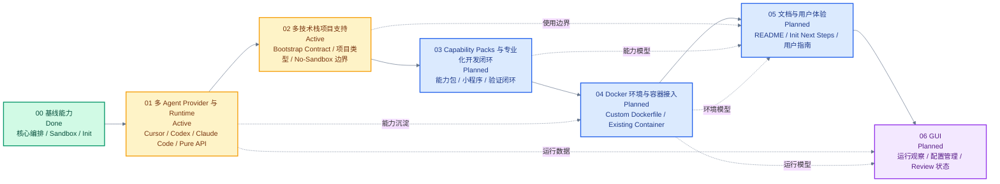

# Roadmap

本 roadmap 以代码与 git 提交为准，用于把 Sandcastle 的阶段性方向、当前进度和后续 PRD 对齐。飞书云文档采用固定映射双向协作；当本地与云端内容冲突时，先人工审阅，再用同步流程覆盖目标文档。

## 00 基线能力

Status: Done

Version: `ecd26a877af1f33827e95b7c5d49bdabdd48a4b7`

Goal: 记录该提交及之前已经稳定存在的 Sandcastle 核心编排、sandbox、agent provider、init 和模板能力。

### Scope

- 程序化 `run()` API、multi-iteration execution、completion signal、commit collection、log-to-file mode、terminal mode 和 agent stream event callback。
- 可插拔 sandbox provider 抽象，包括 bind-mount、isolated、no-sandbox，以及 Docker、Podman、Vercel、Daytona 和 no-sandbox provider。
- Branch strategy 与 worktree model，包括 `head`、`merge-to-head`、显式 `branch`、`.sandcastle/worktrees/`、`createWorktree()` 和 `createSandbox()`。
- Prompt 与 output model，包括 inline prompt、prompt template、argument substitution、sandbox shell expression expansion、`Output.object()` 和 `Output.string()`。
- Claude Code、Codex、Pi、OpenCode agent provider，以及 provider-specific command construction、stream parsing、Claude Code session capture、resume 和 usage parsing。
- Host lifecycle hooks、sandbox lifecycle hooks、`.sandcastle/.env`、provider env merge、`copyToWorktree`、timeout 配置和 `AbortSignal` 取消流程。
- `sandcastle init` 的 `.sandcastle/` scaffold、模板选择、Dockerfile / Containerfile 生成、GitHub Issues / Beads backlog manager、GitHub `Sandcastle` label、内置 workflow 模板，以及 Docker / Podman image 命令。

### Deliverables

- README 覆盖 baseline public API 和 CLI 基础用法。
- ADR 与 `CONTEXT.md` 记录 baseline 架构决策、术语和领域语言。
- 后续阶段不再把本节能力作为未来待实现事项，只描述增强、重构或体验改进。

### Out of Scope

- Fork 之后新增的 Cursor provider、多 runtime init、preset agent roles、bootstrap contract、GUI 和后续文档体验优化。

## 01 多 Agent Provider 与 Runtime

Status: Active

Goal: 让 Sandcastle 可以在同一项目中组合 Cursor、Codex、Claude Code 等 agent provider 与 installed runtimes。

### Scope

- Cursor agent provider 与多 provider 组合工作流。
- `sandcastle init` 中 default scaffold agent 与 installed runtimes 的分离。
- 多 runtime Dockerfile / Containerfile 组合。
- Codex、Cursor、GitHub Issues 等运行时认证 setup flow。
- Preset agent roles 与 provider/runtime 能力矩阵。
- Pure API 模式的目标形态、边界和集成方式探索。

### Deliverables

- `sandcastle init` 能生成以一个默认 scaffold agent 为入口、同时安装多个可用 runtime 的项目配置。
- Runtime image composition 与 auth setup flow 能支持 Cursor、Codex、Claude Code 等组合使用。
- Provider/runtime 的认证、session、stream、resume 和限制在文档中可被清晰比较。
- Pure API 模式有明确 PRD 或设计文档承接，不与 CLI init 行为混杂。

### Tasks

- [x] 增加 Cursor agent provider。
- [x] 区分 default scaffold agent 与 installed runtimes。
- [x] 支持多 runtime Dockerfile / Containerfile composition。
- [x] 增加 Codex、Cursor、GitHub Issues 相关 auth setup flow。
- [x] 完成 preset agent roles 初版。
- [ ] 明确 pure API 模式的目标形态与边界。
- [ ] 梳理 provider/runtime capability matrix。
- [ ] 补齐多 agent provider 组合示例和用户文档。

相关文档：[multi-agent-runtimes-init](./prd/multi-agent-runtimes-init.md)、[preset-agent-roles](./prd/preset-agent-roles.md)。

## 02 多技术栈项目支持

Status: Active

Goal: 让 Sandcastle 不再默认假设 Node 项目，而是通过项目级 bootstrap contract 支持不同语言、框架和构建系统。

### Scope

- `.sandcastle/bootstrap.sh` 作为 repository-specific bootstrap contract。
- `sandcastle init` 按 Project profile 生成 bootstrap script，模板在 sandbox 就绪时执行。
- `sandcastle init` 的 sandbox 入口收敛为 `docker` 与 `no-sandbox`，并把 `podman` 保留为非 init 路径下的可用能力。
- `sandcastle init` 生成的入口文件需要和 sandbox 选择保持一致，并在 no-sandbox 组合下校验必要的 host 依赖。
- 模板不再默认假设 `node_modules`、`npm install` 或 Node-only workflow。
- `sandcastle init` 根据项目类型生成更贴近目标项目的 Dockerfile / Containerfile 基础配置。
- 常见项目类型的 sandbox 环境建议，包括 Node、Python、C++ 等技术栈。
- Unsandboxed / no-sandbox 模式的安全边界、适用场景和用户提示。

### Deliverables

- 非 blank 模板依赖项目内 bootstrap contract，而不是内嵌某一技术栈的安装命令。
- 常见技术栈有可复用 bootstrap 示例，用户可以快速迁移到自己的项目。
- `sandcastle init` 能让用户选择项目类型，并生成包含相应语言运行时、包管理器和验证工具的 sandbox 环境骨架。
- `sandcastle init` 的交互和 scripted 参数与当前策略一致：支持 `docker` 与 `no-sandbox`，不再把 `podman` 作为 init 选项暴露。
- `sandcastle init` 选择 `no-sandbox` 时，生成的 `main.mts` / `main.ts` 会显式使用 `noSandbox()`，并对 `beads` 等 host 依赖给出校验与提示。
- Docker image、mount、auth 和 no-sandbox 行为在跨技术栈项目中有一致说明。

### Tasks

- [x] 非 blank 模板引入 `.sandcastle/bootstrap.sh`。
- [x] 完成 Project profile / bootstrap contract 设计收敛，并同步到 `CONTEXT.md`、ADR 和 roadmap（见 [project-profiles-init-bootstrap](./prd/project-profiles-init-bootstrap.md)、[ADR-0015](./adr/0015-project-profiles-generate-bootstrap-at-init-time.md)）。
- [x] 模板移除对 `node_modules` 或 `npm install` 的默认假设。
- [x] 完成 `sandcastle init` 项目类型选择的产品/交互设计，包括 scripted init 参数和交互式选择（见 [#20](https://github.com/Yibeibankaishui/sandcastle/issues/20)）。
- [x] 完成 Node、Python、C++ Project profiles 的实现拆分与 issue 准备（见 [#23](https://github.com/Yibeibankaishui/sandcastle/issues/23)、[#24](https://github.com/Yibeibankaishui/sandcastle/issues/24)、[#25](https://github.com/Yibeibankaishui/sandcastle/issues/25)）。
- [x] 明确通用 Docker 镜像与 Project profile 的边界，并确认 bootstrap 不参与 image build、不由 init 验证（见 [ADR-0015](./adr/0015-project-profiles-generate-bootstrap-at-init-time.md)）。
- [x] 调整 `sandcastle init` 的 sandbox 选项：新增 `no-sandbox`，隐藏 `podman`（保留 podman 命令与运行时代码）。
- [x] 修复 `sandcastle init` 的 scaffold 入口与 sandbox 选择脱节的问题，并为 `no-sandbox + beads` 增加 `bd` host 依赖校验与提示。
- [ ] 实现 `generic` Project profile 与 `--project-profile` 基础路径（见 [#21](https://github.com/Yibeibankaishui/sandcastle/issues/21)）。
- [ ] 实现模板侧 runtime bootstrap generation 移除（见 [#22](https://github.com/Yibeibankaishui/sandcastle/issues/22)）。
- [ ] 实现 Node、Python、C++ Project profiles（见 [#23](https://github.com/Yibeibankaishui/sandcastle/issues/23)、[#24](https://github.com/Yibeibankaishui/sandcastle/issues/24)、[#25](https://github.com/Yibeibankaishui/sandcastle/issues/25)）。
- [ ] 为常见技术栈沉淀 bootstrap 示例。
- [x] 梳理并落地 `noSandbox()` 在 `run()` / `createSandbox()` 中的使用边界与适用场景。
- [ ] 修复 init 生成的 auth mount 目录缺失导致 sandbox 启动前失败的问题（见 [#19](https://github.com/Yibeibankaishui/sandcastle/issues/19)）。

相关文档：[project-profiles-init-bootstrap](./prd/project-profiles-init-bootstrap.md)、[ADR-0015](./adr/0015-project-profiles-generate-bootstrap-at-init-time.md)、[bootstrap-template-contract](../.changeset/bootstrap-template-contract.md)。

## 03 Capability Packs 与专业化开发闭环

Status: Planned

Target: [capability-packs](./prd/capability-packs.md)

Goal: 让 `sandcastle init` 可以显式选择专业化能力包，生成包含工具上下文、agent 规则和验证入口的开发闭环。

### Scope

- Capability pack 作为显式 init-time 选择，组合 template、Project profile、preset agents、skills、context files、verification entrypoint 和 capability add-ons。
- Capability pack 默认值与显式 init flags 的优先级规则。
- 小程序能力包默认使用 `parallel-planner-with-review`，并支持 `parallel-planner`、`parallel-planner-with-review`、`sequential-reviewer`、`simple-loop` 等模板。
- Init-time prompt assembly，把 preset role、skill、capability context、verification guidance 和选中的 add-on guidance 生成到可编辑 prompt template。
- `.sandcastle/capability.json` capability manifest。
- `.sandcastle/verify.sh` verification entrypoint。
- `generic` 与 `miniprogram` 两个第一版 capability packs，其中小程序第一版只支持 native capability variant。
- WeChat Mini Program core loop：`.sandcastle/verify.sh`、`npm run wx:check`、`miniprogram-ci preview`（检测到配置时自动调用）、`debug/wx-check.log`。
- `.sandcastle/wx-check-native.mjs` native fallback verifier，用于没有项目级 `wx:check` 时的原生小程序结构检查。
- 小程序 init-time project setup：检测 `miniprogram-ci`，缺失时让用户选择是否安装到项目中。
- no-sandbox-only Mini Program capability add-on：`runtime-debug`（WeChat DevTools MCP）。

### Deliverables

- `sandcastle init --capability miniprogram` 可以生成专业化的小程序 agent 环境。
- 小程序第一版能力包可以在原生微信小程序项目中提供默认 verifier；Taro、uni-app 等跨端框架会被明确标记为 unsupported variant。
- 小程序默认 verifier 在未配置 `miniprogram-ci` 时继续本地闭环；检测到上传密钥等平台验证配置时必须调用 `miniprogram-ci preview`，配置错误则失败并写入诊断。
- 小程序 init 会检测 `miniprogram-ci` 并在缺失时提供显式项目安装选择；用户拒绝安装时 init 仍可完成并给出后续配置指引。
- 小程序 init 会生成 `.sandcastle/context/miniprogram-setup.md`，记录检测结果、后续配置步骤和上传密钥安全提醒。
- 小程序能力包在 Docker / no-sandbox 下都有稳定的 CLI 主验证闭环。
- 小程序能力包在支持模板中保持同一套 verification contract；显式选择 `blank` 时给出手动接入验证入口的 warning。
- no-sandbox 下可选择 runtime-debug add-on，生成对应上下文和 prompt guidance，但不自动安装、登录或启动 WeChat Developer Tools。
- 生成的 prompt templates 能确定性携带小程序 skill、context、verification guidance 和 add-on guidance。
- Capability pack registry、add-on compatibility、manifest 和 scaffold 输出有测试覆盖。
- README / 用户文档能说明 Project profile、template、preset agent、skill、capability pack、capability add-on 的区别。

### Tasks

- [x] 记录 capability pack 领域术语与设计取舍到 `CONTEXT.md` 和 [ADR-0016](./adr/0016-capability-packs-compose-specialized-init-scaffolds.md)。
- [x] 创建 capability packs PRD：[capability-packs](./prd/capability-packs.md)，并发布为 [#39](https://github.com/Yibeibankaishui/sandcastle/issues/39)。
- [ ] 实现 capability pack registry 与 `generic` / `miniprogram` 定义。
- [ ] 实现小程序 native capability variant 与 `.sandcastle/wx-check-native.mjs` fallback verifier，包括检测到 `miniprogram-ci` 配置时自动执行 `preview`。
- [ ] 实现小程序 init-time `miniprogram-ci` 检测、可选项目安装和缺失时 next-step guidance。
- [ ] 扩展 `sandcastle init`，支持 `--capability` 与交互式 capability pack 选择。
- [ ] 实现 capability defaults 与显式 init flags 的覆盖规则。
- [ ] 实现 Mini Program core scaffold，包括 capability manifest、verification entrypoint、context files 和 prompt assembly。
- [ ] 生成 `.sandcastle/context/miniprogram-setup.md`，并在 assembled Mini Program prompts 中引用。
- [x] 实现 no-sandbox-only `runtime-debug` capability add-on。
- [ ] 扩充 Mini Program preset agent 和 bundled skill，使其遵守 CLI 验证闭环。
- [ ] 为 capability registry、add-on compatibility、manifest、prompt assembly 和 init scaffold 增加测试。
- [ ] 更新 README / 用户指南，并按需补充 changeset。

### Out of Scope

- 第一版不实现 web 或 game capability packs。
- 第一版不支持 Taro、uni-app、mpvue 等非原生小程序 variant。
- 第一版不自动推断 capability pack。
- 第一版不新增 `run({ agentProfile })` public runtime API。
- 第一版不静默修改 host repo application files；用户显式同意的 setup action 可以安装 `miniprogram-ci` 到项目中。
- 第一版不自动安装 `wechat-devtools-mcp`、不启动或登录 WeChat Developer Tools。
- 第一版不实现 CloudBase capability add-on。

## 04 Docker 环境与容器接入

Status: Planned

Goal: 让高级用户可以清晰地复用自定义 Dockerfile、现有 image 或受控容器，同时保持 Sandcastle 对 sandbox 生命周期、worktree 和权限边界的可解释性。

### Scope

- 将现有 `sandcastle docker build-image --dockerfile` / `podman build-image --containerfile` 能力梳理成完整的用户路径。
- 支持用户在 init 或入口脚本中选择自定义 Dockerfile / Containerfile，并将其与 image name、build context、UID/GID build args 和 runtime mounts 对齐。
- 探索接入已经创建好的 Docker 容器作为高级 sandbox provider 的可行性。
- 明确外部容器模式的生命周期所有权、worktree 挂载契约、环境变量注入、网络、清理责任和错误提示。

### Deliverables

- 用户可以选择自定义 Dockerfile / Containerfile 作为 sandbox image 来源，并通过文档理解何时需要重新 build。
- 自定义 image 与 Sandcastle 的 `docker()` / `podman()` provider 配置关系被清楚记录。
- 已有容器接入有明确设计结论：若采用，需要形成独立 provider 或显式 experimental API；若不采用，需要记录替代方案。
- Docker 环境能力矩阵说明哪些能力来自 image、哪些来自 runtime mount、哪些来自 hooks。

### Tasks

- [ ] 梳理当前 `build-image --dockerfile` / `--containerfile` 已有能力与缺口。
- [ ] 设计 init 层面的自定义 Dockerfile / Containerfile 输入路径。
- [ ] 设计 JS API 层的自定义 image / build artifact 使用方式。
- [ ] 评估 existing container provider 的安全边界和 lifecycle contract。
- [ ] 为 Docker image、container、mount、hook 和 `.sandcastle/.env` 的职责边界补充用户文档。

### Out of Scope

- 不把已有容器接入作为默认 AFK 路径。
- 不把 no-sandbox provider 作为默认 AFK 路径；仅保留显式 opt-in 的 host 执行模式。
- 不在本阶段内提供完整 Docker Compose 编排。

## 05 文档与用户体验

Status: Planned

Goal: 让用户能从 README、模板、init next steps 和 roadmap 中理解 Sandcastle 的核心模型与当前推荐工作流。

### Scope

- README 与当前代码、CLI 行为、public API 的对齐。
- Init 生成后的 next steps、模板内注释和用户提示。
- Provider、runtime、template、preset role、sandbox、bootstrap contract 等核心概念的用户向解释。
- Capability pack、capability add-on、verification entrypoint 和 prompt assembly 的用户向解释。
- Local roadmap 与飞书云文档的同步维护约定。

### Deliverables

- README 不再停留在 baseline 状态，能反映 fork 后已经落地的主要能力。
- 用户可以根据文档选择 agent provider、runtime、sandbox provider、template 和 backlog manager。
- 用户可以理解何时选择 Project profile、template、preset agent 或 capability pack。
- Roadmap 阶段与 PRD、ADR、changeset 或 issue 建立轻量链接，避免把长设计细节塞进 roadmap。

### Tasks

- [ ] 审阅 README，并按当前代码更新 public API 与 CLI 示例（Project profile 文档收口见 [#26](https://github.com/Yibeibankaishui/sandcastle/issues/26)）。
- [ ] 补齐 provider/runtime/template/preset role 的概念说明。
- [ ] 补齐 capability pack 和小程序开发闭环说明（见 [capability-packs](./prd/capability-packs.md)、[ADR-0016](./adr/0016-capability-packs-compose-specialized-init-scaffolds.md)）。
- [ ] 为常见工作流补充用户指南。
- [ ] 建立 roadmap 与 PRD、ADR、changeset、issue 的链接规范。

## 06 GUI

Status: Planned

Goal: 提供可视化界面，用于配置、运行、观察和管理 Sandcastle workflow。

### Scope

- GUI 的核心用户路径、信息架构和运行入口。
- Run、sandbox、branch、logs、agent stream、commits 和 review 状态的可视化模型。
- GUI 与现有 CLI / JS API 的边界、复用关系和数据来源。

### Deliverables

- GUI 的目标用户、核心流程和最小可用范围被明确记录。
- 可视化状态模型能覆盖 Sandcastle 的 run lifecycle、sandbox lifecycle 和 agent output。
- GUI 后续实现有独立 PRD 或设计文档承接。

### Tasks

- [ ] 定义 GUI 的核心用户路径。
- [ ] 设计 run / sandbox / branch / logs / agent stream 的可视化模型。
- [ ] 明确 GUI 与现有 CLI / JS API 的关系。
